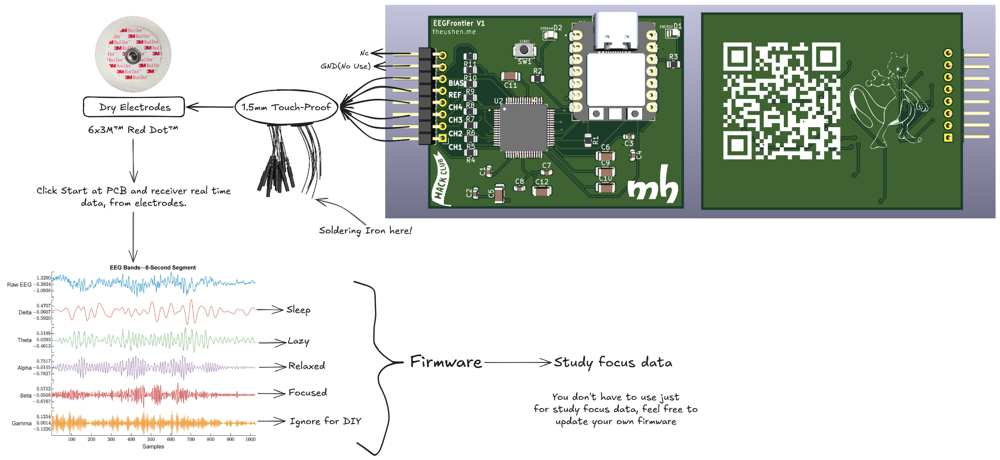
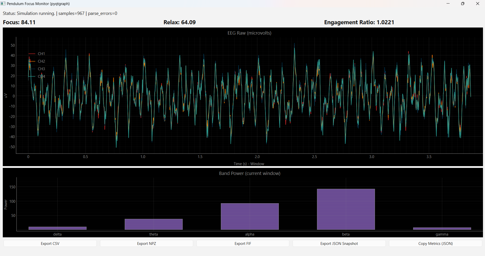
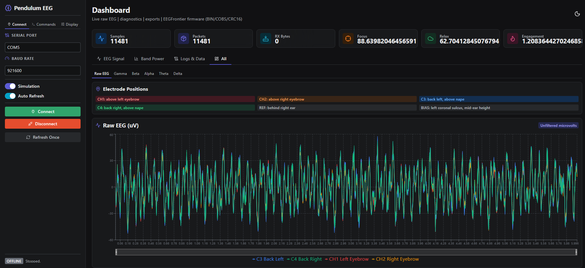
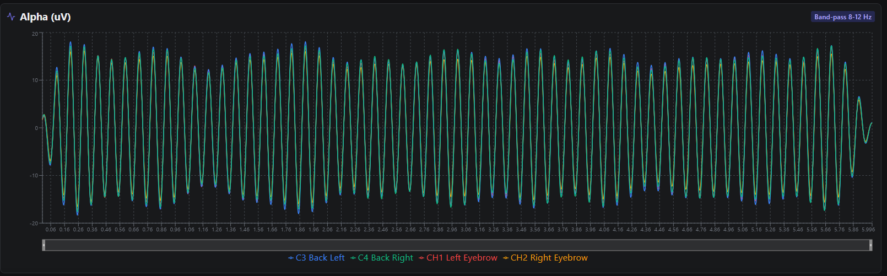

# EEGFrontier V1

EEGFrontier V1 is a compact EEG acquisition board built around the **ADS1299-4PAGR** and a **Seeed XIAO RP2040**.

This repository contains:
- Hardware design files (KiCad)
- Firmware (PlatformIO / Arduino)
- Project assets and documentation images

## Important Notice

Please check the `bom/` folder for the Bill of Materials and pricing information. A dedicated folder was created specifically to document BOM details and cost references.

## Short Project Description

**EEGFrontier V1** is an open-source EEG acquisition board designed to capture real brain signals and stream them in real time to a computer for analysis and visualization.
It focuses on learning, experimentation, and understanding attention and focus using raw EEG data.

---

## How to Use the Project

The board connects to EEG electrodes and streams data over USB to a computer.
Users flash the firmware to the XIAO RP2040, connect electrodes to the header, and read real-time EEG data using serial tools or custom software written in any language.

## Why I Made This Project

I made EEGFrontier to learn how real EEG hardware works beyond black-box consumer devices.
The goal is to make neurotechnology more accessible to students by providing a platform where raw signals, hardware design, and firmware are fully open and modifiable.

---

## Project Concept

The board is designed to connect dry electrodes and stream real-time data from the EEG channels.



## Hardware Overview

### 3D View (Front)


### 3D View (Back)


### PCB Layout


### Schematic


## Quick Start

1. Flash the firmware to the Seeed XIAO RP2040 using PlatformIO
2. Connect the EEGFrontier board via USB
3. Attach EEG electrodes (channels, REF, BIAS)
4. Open Pendulum or a serial monitor
5. Start streaming with the `START` command

## Hardware Highlights

- ADS1299-based 4-channel EEG analog front-end
- Seeed XIAO RP2040 as main controller
- Header for EEG channels plus reference and bias
- Start button input (`BTN_START`)
- Status LEDs (power and stream/activity)
- Compact PCB with front/back annotated design

## Firmware Overview

The firmware (in `firmware/`) provides:
- ADS1299 initialization and register configuration
- DRDY interrupt-based sampling
- Binary streaming protocol (COBS + CRC16)
- CSV debug mode
- Serial commands for diagnostics and control
- Recovery logic for acquisition timeout
- Self-test and lead-off diagnostics

## Firmware Build (PlatformIO)

```bash
cd firmware
pio run -e xiao_rp2040
```

Monitor (default baud rate is `921600`):

```bash
cd firmware
pio device monitor -b 921600
```

## Serial Commands (Firmware)

- `HELP`
- `INFO`
- `STATS`
- `REGS`
- `START`
- `STOP`
- `MODE BIN`
- `MODE CSV`
- `REINIT`
- `TEST ON`
- `TEST OFF`
- `SELFTEST`
- `LOFF ON`
- `LOFF OFF`
- `LOFF STATUS`
- `PING`

## Technical Specifications

- Channels: 4 EEG channels + REF + BIAS
- ADC: 24-bit (ADS1299)
- Sampling rate: configurable (up to ADS1299 limits)
- Interface: USB (CDC)
- Power: USB 5V

## Repository Structure

- `firmware/` - PlatformIO firmware for XIAO RP2040 + ADS1299
- `assets/` - Images used in this README
- `EEGFrontier.kicad_sch` / `EEGFrontier.kicad_pcb` - KiCad project files
- `Pendulum` - Host software

## Pendulum

**Pendulum** is the host software suite for EEGFrontier: it reads EEG data over USB, offers a local web dashboard (Reflex), and includes a desktop monitor for real-time focus visualization.

For full setup and usage instructions, see `Pendulum/README.md`.








## If you are considering building this

I strongly recommend **not** attempting to fully hand-solder this PCB.

The board uses fine-pitch components and sensitive analog circuitry, which makes manual soldering difficult and error-prone. Instead, consider ordering the PCB **fully assembled** from a service such as **JLCPCB**.

If needed, you can then hand-solder only a few missing components — or none at all if everything is available for assembly.

## Safety & Protection

⚠️ **Important Safety Notice**

This device interfaces electrically with the human body and must be used with caution.

- This project **does not include medical-grade isolation** and **must never be connected to mains-powered equipment** without proper USB isolation.
- Always operate the device using a **battery-powered computer** or a **USB isolator** specifically designed for biomedical signals.
- Never use the device if any part of the circuit is damaged, exposed, or improperly assembled.
- Ensure electrodes and cables are clean, dry, and in good condition before use.
- Do **not** use this device on individuals with implanted electronic devices (e.g. pacemakers).
- This project is intended **strictly for research, education, and experimentation**.

The author assumes **no responsibility for misuse**, improper assembly, or unsafe operating conditions.

By using or building this device, you acknowledge that you understand the risks involved in working with bioelectrical signals and accept full responsibility for its use.

## Medical Disclaimer

This project is **not a medical device** and is **not intended for diagnosis, treatment, or clinical use**.

Any data produced by this device should be considered experimental and for educational or research purposes only.

## Known Limitations

- No medical-grade isolation
- No onboard battery
- Susceptible to motion artifacts with dry electrodes
- Requires external software for filtering and analysis(Use Pendulum :)

## License

This project is released under the MIT License.
See the `LICENSE` file for details.