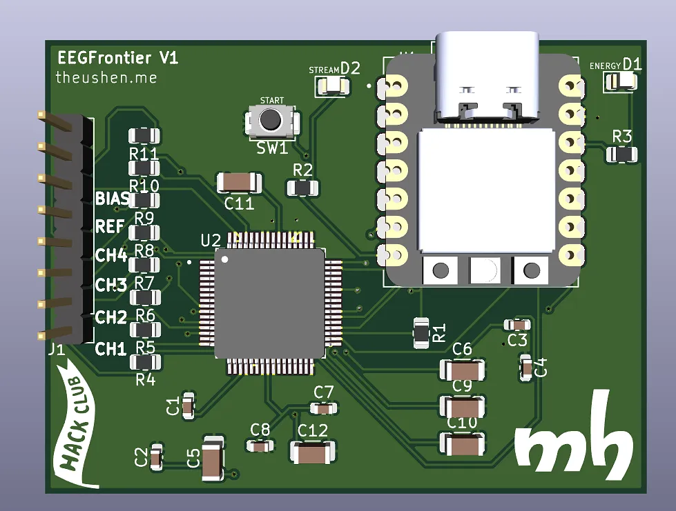
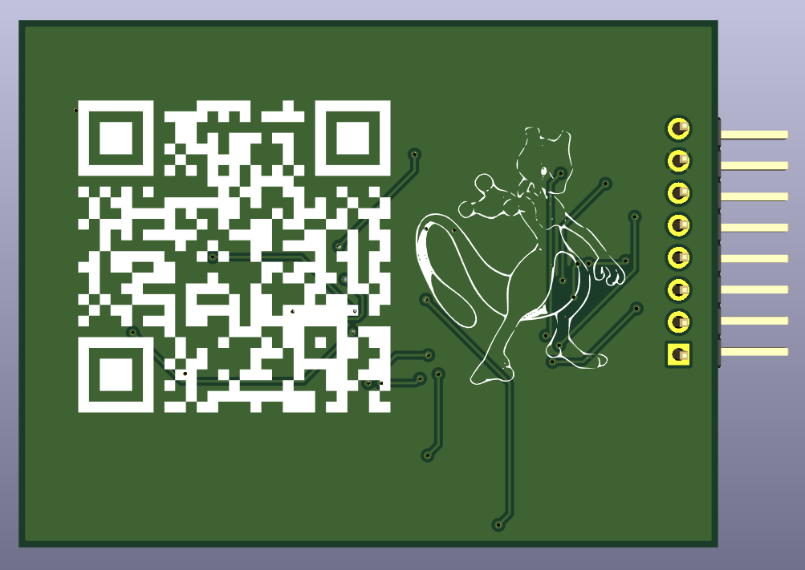
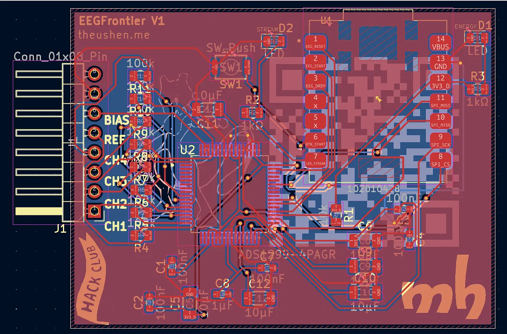

# EEGFrontier V1

EEGFrontier V1 is a compact EEG acquisition board built around the **ADS1299-4PAGR** and a **Seeed XIAO RP2040**.

This repository contains:
- Hardware design files (KiCad)
- Firmware (PlatformIO / Arduino)
- Project assets and documentation images

## Important Notice

Please check the `bom/` folder for the Bill of Materials and pricing information. A dedicated folder was created specifically to document BOM details and cost references.

## Project Concept

The board is designed to connect dry electrodes and stream real-time data from the EEG channels.


## Hardware Overview

### 3D View (Front)



### 3D View (Back)



### PCB Layout



### Schematic


## Hardware Highlights

- ADS1299-based 4-channel EEG analog front-end
- Seeed XIAO RP2040 as main controller
- Header for EEG channels plus reference and bias
- Start button input (`BTN_START`)
- Status LEDs (power and stream/activity)
- Compact PCB with front/back annotated design

## Firmware Overview

The firmware (in `firmware/`) provides:
- ADS1299 initialization and register configuration
- DRDY interrupt-based sampling
- Binary streaming protocol (COBS + CRC16)
- CSV debug mode
- Serial commands for diagnostics and control
- Recovery logic for acquisition timeout
- Self-test and lead-off diagnostics

## Firmware Build (PlatformIO)

```bash
cd firmware
pio run -e xiao_rp2040
```

Monitor (default baud rate is `921600`):

```bash
cd firmware
pio device monitor -b 921600
```

## Serial Commands (Firmware)

- `HELP`
- `INFO`
- `STATS`
- `REGS`
- `START`
- `STOP`
- `MODE BIN`
- `MODE CSV`
- `REINIT`
- `TEST ON`
- `TEST OFF`
- `SELFTEST`
- `LOFF ON`
- `LOFF OFF`
- `LOFF STATUS`
- `PING`

## Repository Structure

- `firmware/` - PlatformIO firmware for XIAO RP2040 + ADS1299
- `assets/` - Images used in this README
- `EEGFrontier.kicad_sch` / `EEGFrontier.kicad_pcb` - KiCad project files

## Disclaimer

This project is a hardware/firmware prototype for development and experimentation. It is not a certified medical device.
