# EEGFrontier V2

EEGFrontier is an open-source EEG acquisition platform built around Texas Instruments ADS1299 and the Seeed XIAO RP2040.

This repository includes:
- Hardware design files (KiCad)
- Firmware (PlatformIO / Arduino)
- Project assets and documentation images
- Host software (`Pendulum`)

## Current Status

This branch introduces the **V2 PCB** update:
- Migration to **ADS1299IPAGR** and **8 EEG channels**
- PCB rework focused on lower noise
- Curved routing for cleaner analog signal paths
- Revised GND strategy (less direct GND trace routing in sensitive analog areas)

Still pending on V2:
- BOM update
- Firmware update and validation for the new hardware revision

## V1 vs V2 Snapshot

| Topic | V1 | V2 |
|---|---|---|
| Analog front-end | ADS1299-4PAGR (4 channels) | ADS1299IPAGR (8 channels) |
| PCB routing style | Conventional routing | Curved tracks and analog cleanup |
| Noise-focused changes | Baseline | GND/routing revisions to reduce coupling and noise |

## Visual Comparison

### 3D View (Front)

| V1 | V2 |
|---|---|
| 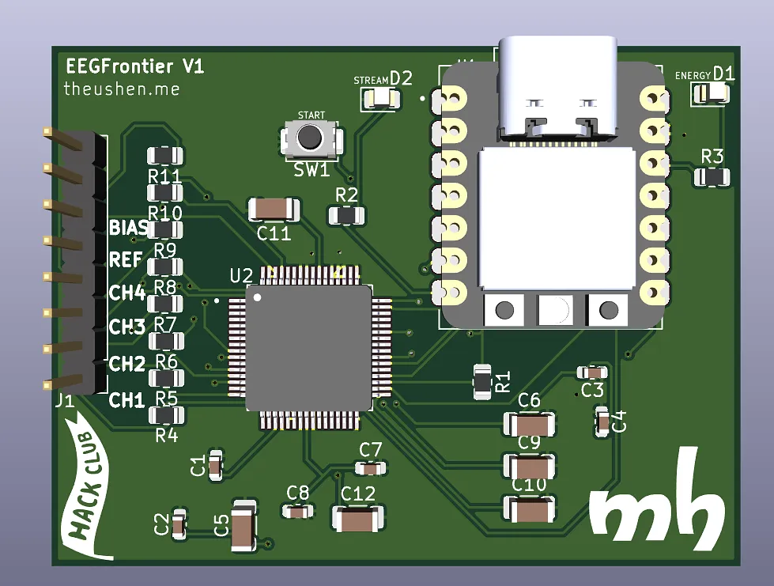 | 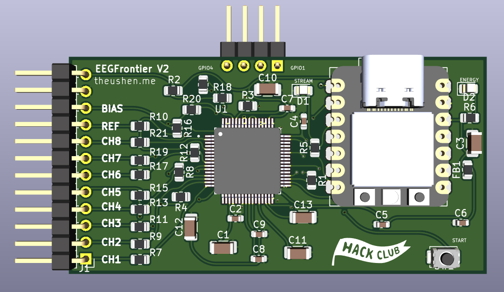 |

### 3D View (Back)

| V1 | V2 |
|---|---|
| 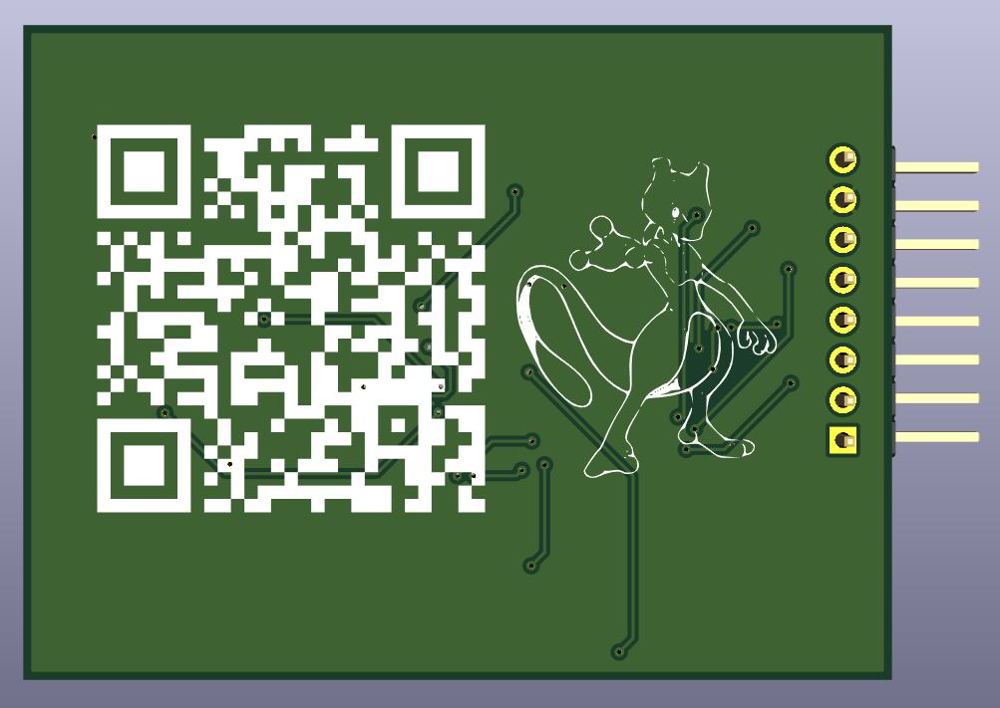 | 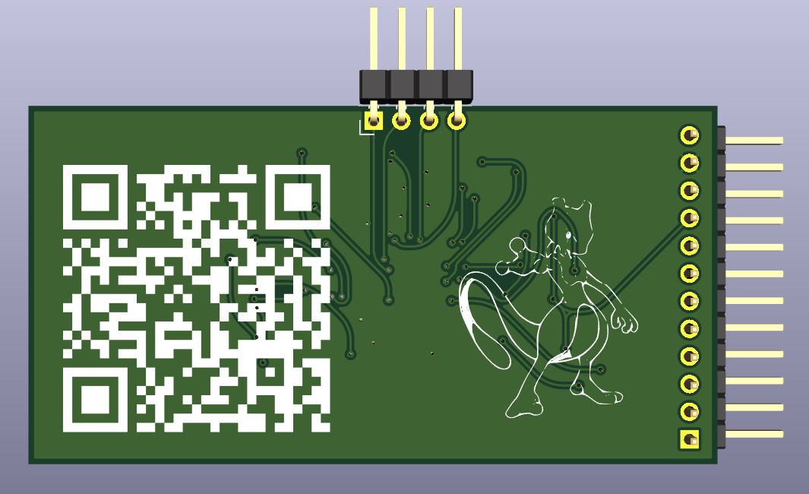 |

### PCB Layout

| V1 | V2 |
|---|---|
| 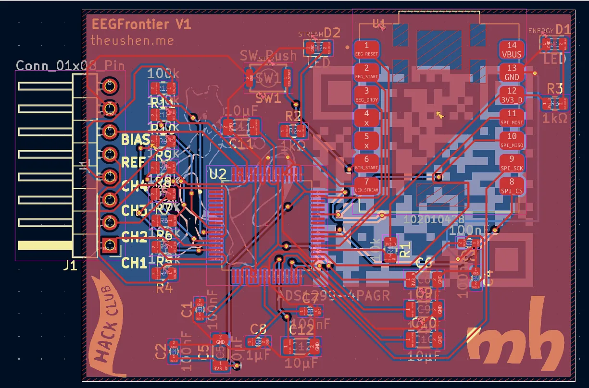 | 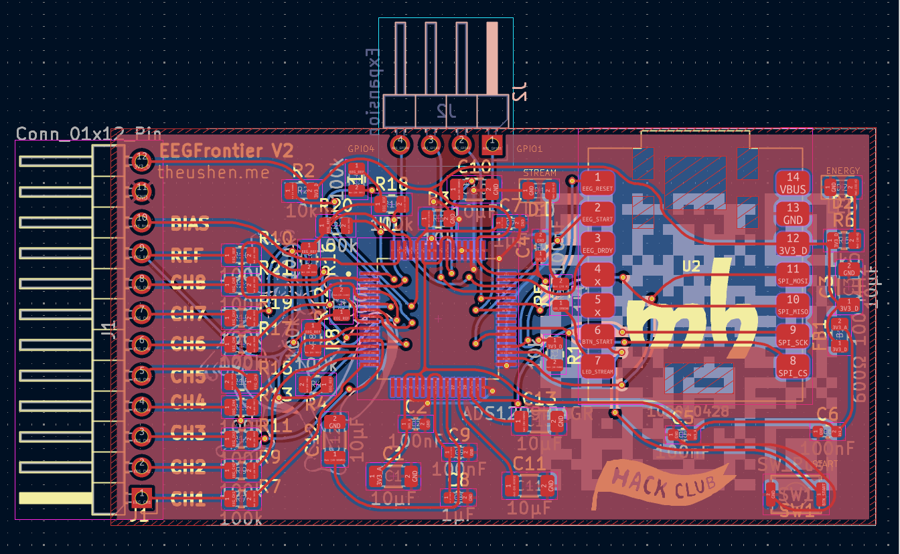 |

### Schematic

| V1 | V2 |
|---|---|
| 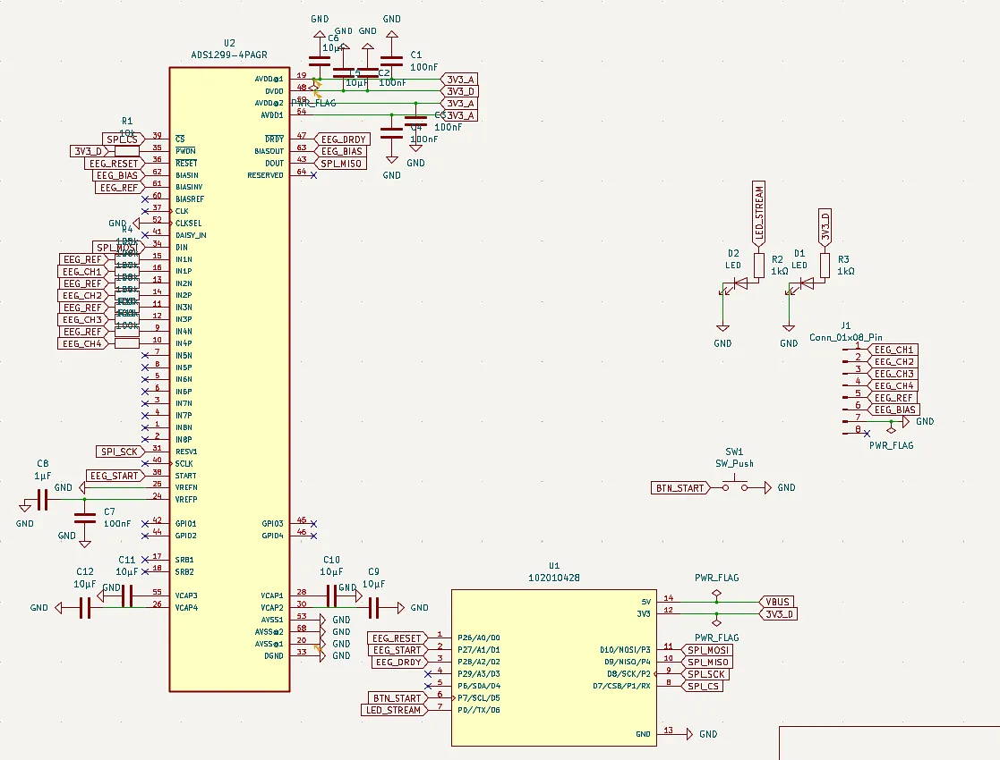 | 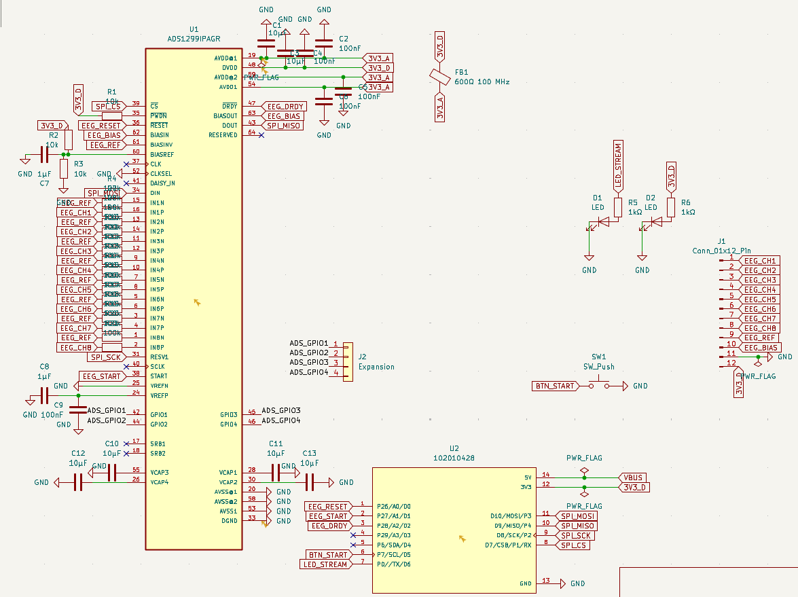 |

## Project Concept

The board connects dry electrodes and streams real-time EEG data to a computer over USB for analysis and visualization.
The main objective is practical learning: open hardware + open firmware + transparent signal chain.

## Quick Start

1. Flash the firmware to the Seeed XIAO RP2040 using PlatformIO.
2. Connect the EEGFrontier board via USB.
3. Attach EEG electrodes (channels, REF, BIAS).
4. Open Pendulum or a serial monitor.
5. Start streaming with the `START` command.

## Hardware Highlights (V2)

- ADS1299IPAGR-based 8-channel EEG analog front-end
- Seeed XIAO RP2040 as main controller
- Input header for EEG channels + reference + bias
- Start button input (`BTN_START`)
- Status LEDs (power and stream/activity)
- Compact two-layer PCB with revised analog routing decisions

## Firmware Overview

The firmware in `firmware/` currently provides:
- ADS1299 initialization and register configuration
- DRDY interrupt-based sampling
- Binary streaming protocol (COBS + CRC16)
- CSV debug mode
- Serial commands for diagnostics and control
- Recovery logic for acquisition timeout
- Self-test and lead-off diagnostics

Note: firmware behavior and defaults still need full alignment with the V2 hardware revision.

## Firmware Build (PlatformIO)

```bash
cd firmware
pio run -e xiao_rp2040
```

Monitor (default baud rate `921600`):

```bash
cd firmware
pio device monitor -b 921600
```

## Serial Commands (Firmware)

- `HELP`
- `INFO`
- `STATS`
- `REGS`
- `START`
- `STOP`
- `MODE BIN`
- `MODE CSV`
- `REINIT`
- `TEST ON`
- `TEST OFF`
- `SELFTEST`
- `LOFF ON`
- `LOFF OFF`
- `LOFF STATUS`
- `PING`

## Technical Specifications

- Channels: 8 EEG channels + REF + BIAS (V2 target)
- ADC: 24-bit (ADS1299 family)
- Sampling rate: configurable (up to ADS1299 limits)
- Interface: USB (CDC)
- Power: USB 5V

## Repository Structure

- `firmware/` - PlatformIO firmware for XIAO RP2040 + ADS1299
- `assets/` - Images used in this README
- `bom/` - Bill of Materials and pricing references
- `EEGFrontier.kicad_sch` / `EEGFrontier.kicad_pcb` - KiCad project files
- `Pendulum/` - Host software suite (**OUTDATED for V2 / 8 channels**)

## Pendulum (OUTDATED)

Outdated status:
- The current `Pendulum` implementation is still aligned with the previous channel configuration.
- It needs to be updated to fully support the V2 hardware changes (8 channels via ADS1299IPAGR).

For now, `Pendulum/README.md` should be treated as historical reference until the 8-channel update is done.

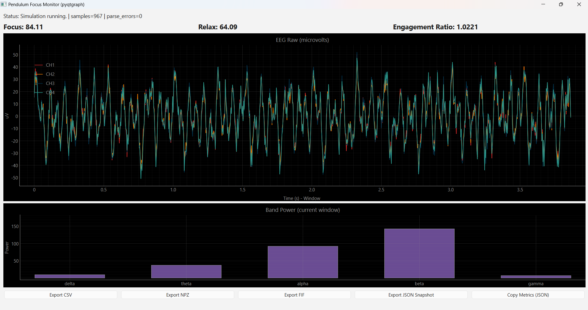
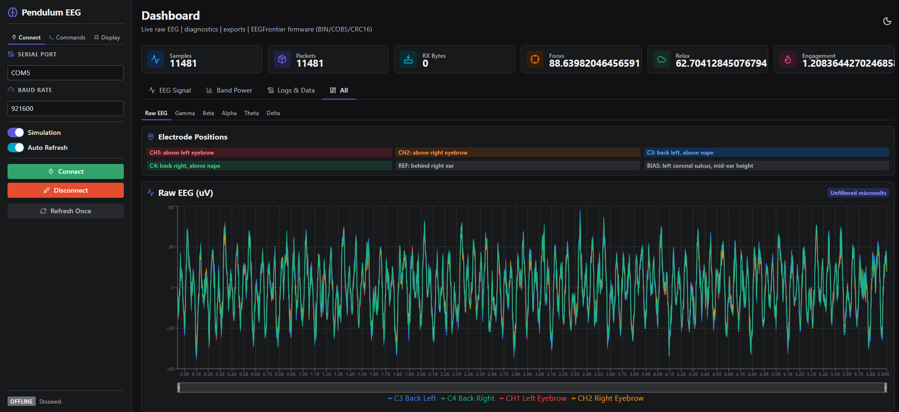
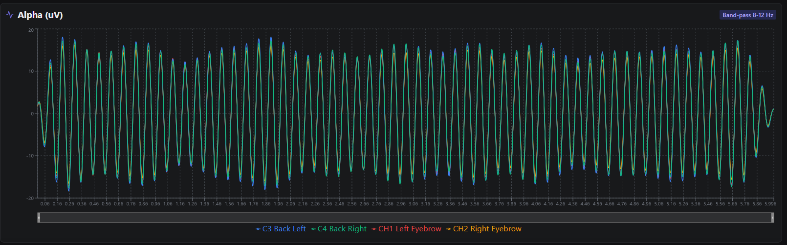


## Manufacturing Recommendation

Fully hand-soldering this board is not recommended.

The design uses fine-pitch components and sensitive analog circuitry. Prefer full assembly from a professional PCB assembly service (for example, JLCPCB), then hand-solder only unavoidable missing parts if necessary.

## Safety and Protection

Important safety notice:

This device interfaces electrically with the human body and must be used with caution.

- This project does not include medical-grade isolation.
- Never connect it to mains-powered equipment without proper USB isolation.
- Always operate with a battery-powered computer or a biomedical USB isolator.
- Do not use if the board, cables, or electrodes are damaged.
- Do not use on individuals with implanted electronic devices (for example, pacemakers).
- This project is for research, education, and experimentation only.

The author assumes no responsibility for misuse, unsafe assembly, or unsafe operation.

## Medical Disclaimer

This project is not a medical device and is not intended for diagnosis, treatment, or clinical use.

Any produced data is experimental and for education/research use only.

## Known Limitations

- No medical-grade isolation
- No onboard battery
- Susceptible to motion artifacts with dry electrodes
- Requires external software for filtering and analysis (for example, Pendulum)
- V2 BOM and firmware migration are still in progress
- Pendulum host software is outdated and still pending migration to 8 channels

## License

This project is released under the MIT License.
See `LICENSE` for details.
