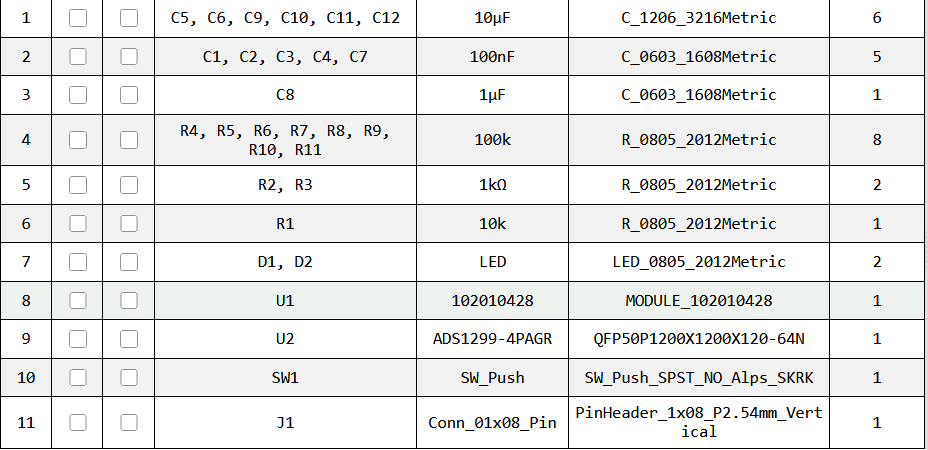
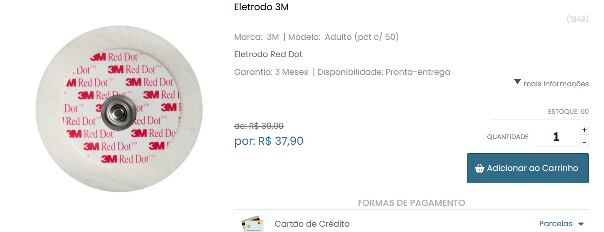
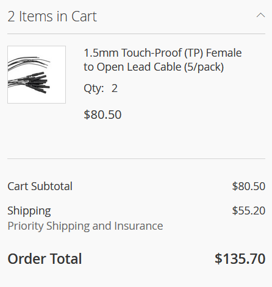
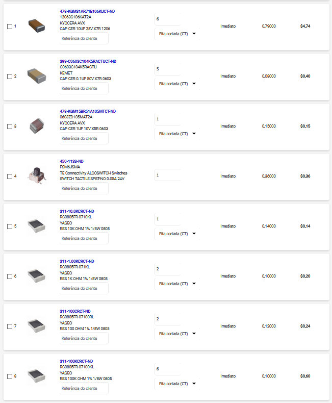
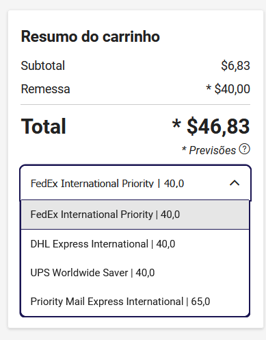
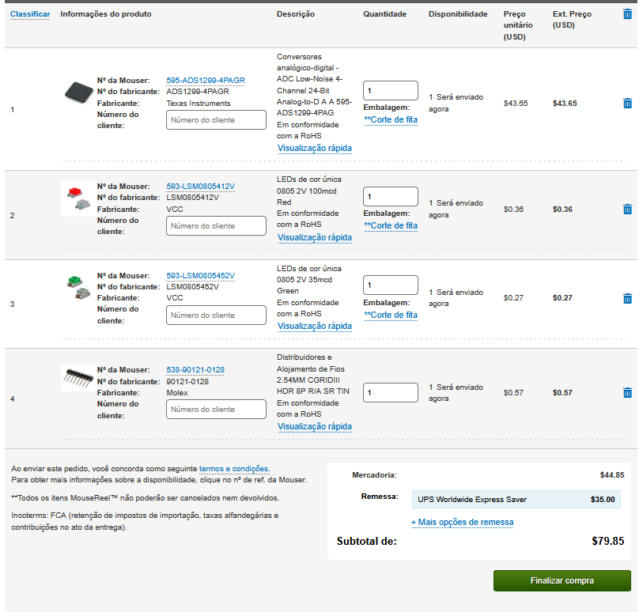

# BOM and Price Notes (EEGFrontier V1)

This folder contains the Bill of Materials references, price snapshots, and purchase/cart screenshots used for the **EEGFrontier V1** prototype.

## Important Notes

- Prices are a snapshot and may change over time.
- Shipping/import costs can vary by country and carrier.
- The USD values below follow the original CSV notation and include mixed formatting from the vendor/cart screenshots.

## Files in This Folder

- `ibom.html` - Interactive BOM export
- `pcb_bom.png` - BOM placement/table screenshot
- `assets/` - Vendor/product/cart screenshots

## Price Table (replicated from `Prices.csv`)

| URL / Vendor | Item | Qty | Product + Shipping | USD (5.14 BRL/USD) |
| --- | --- | --- | --- | --- |
| https://www.santoantoniodist.com.br/eletrodo3m/prod-9760997/ | Eletrodo 3M | 1x50 | R$ 37,90 + R$ 24,20 | USD $12,08 |
| https://shop.neurospec.com/1-5mm-touchproof-female-to-open-lead-cable-5-pack | 1.5mm Touch-Proof (TP) Female to Open Lead Cable (5/pack) | 2x5 | R$ 413,81 + R$ 283,75 | USD $135,70 |
| br.mouser.com | ADS1299-4PAGR | 1x1 | Included in Mouser cart | Mouser Cart: $79.85 |
| www.digikey.com.br | Push Button | 1x1 | Included in DigiKey cart | DigiKey Cart: $46,83 |
| br.mouser.com | Header 1x08 | 1x1 | Included in Mouser cart | Mouser Cart: $79.85 |
| br.mouser.com | LEDs 0805 | 1x2 | Included in Mouser cart | Mouser Cart: $79.85 |
| www.digikey.com.br | 0805 Resistors | 1x11 | Included in DigiKey cart | DigiKey Cart: $46,83 |
| www.digikey.com.br | 1µF 0603 capacitor | 1x1 | Included in DigiKey cart | DigiKey Cart: $46,83 |
| www.digikey.com.br | 100nF 0603 capacitor | 1x5 | Included in DigiKey cart | DigiKey Cart: $46,83 |
| www.digikey.com.br | 10µF 1206 capacitor | 1x6 | Included in DigiKey cart | DigiKey Cart: $46,83 |

### Estimated Total

- **Total: $274,46** (as recorded in the original price sheet)

## BOM / Placement Reference

## Component / Purchase References

### Electrodes (3M Red Dot)

### Touch-Proof Cables

### DigiKey Items (components list)

### DigiKey Cart Summary

### Mouser Cart Summary

## Notes for Rebuilds

- Re-quote Mouser and DigiKey carts before ordering.
- Confirm local availability/substitutions for passives and LEDs.
- Review `ibom.html` together with the KiCad PCB file before assembling.
